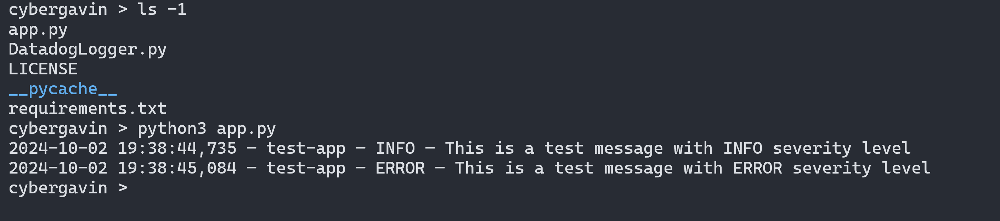
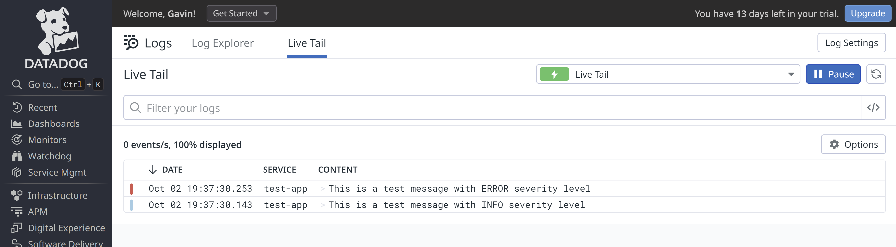

# Datadog Logger for Python

This repo demonstrates the use of a DatadogLogger class to leverage the python `datadog_api_client` module to log messages to stdout and Datadog.

## Prerequisites

1. You must have an account with Datadog and set the following environment variables:

    export DD_API_KEY='<Your Datadog API Key>'
    export DD_SITE='<Your Datadog site>'

2. Ensure that there's no index filter on Datadog that's denying the ingestion of your logs. If you set up a trial account, then this won't be an issue as all logs will be ingested into the `main` index.

## Usage

To test the DatadogLogger class, clone this repo and follow the instructions below.

### STEP 1: Install required python modules

    pip install -r requirements.txt

### STEP 2: Execute test code (app.py)

    python app.py

The screenshot below shows the above command execution.

### STEP 3: Check datadog Log Explorer

As shown in the screenshot below, confirm logs receipt on Datadog.

